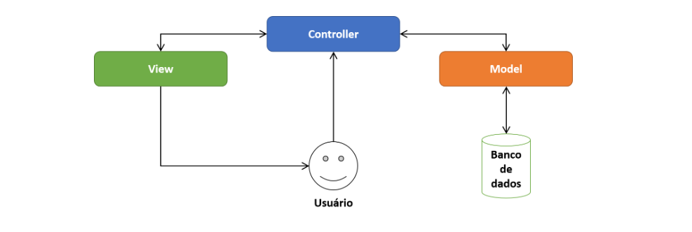
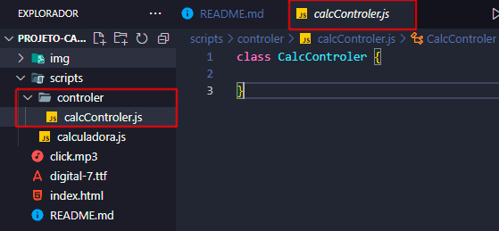
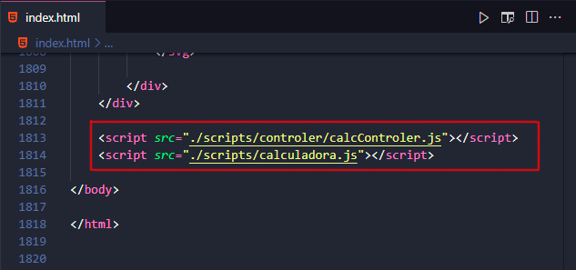
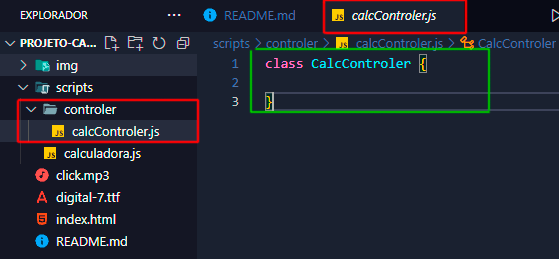
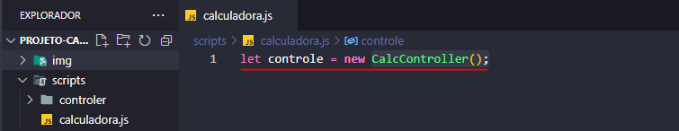
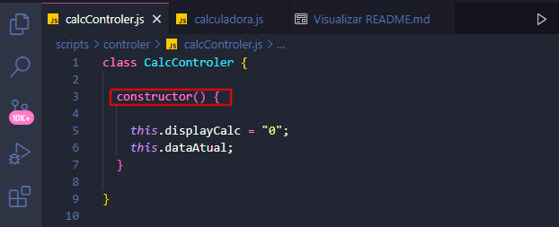
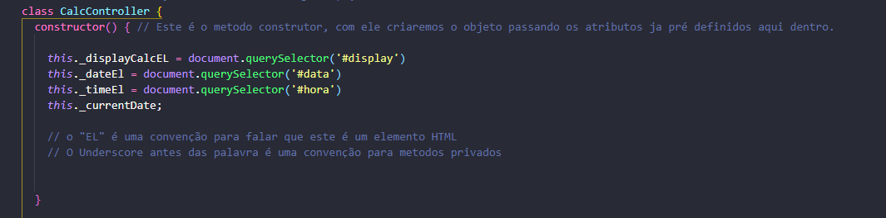
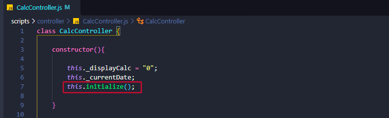
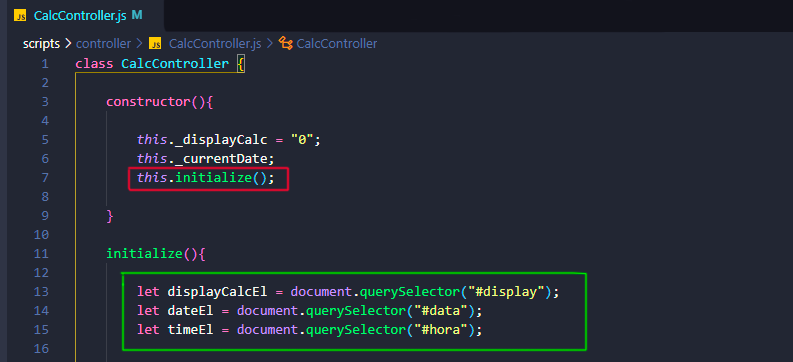
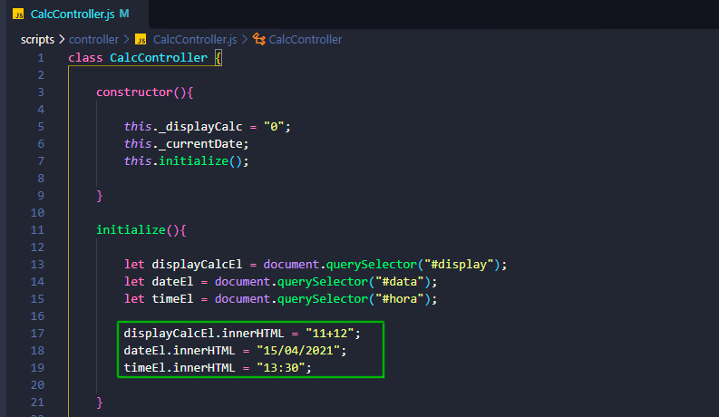

# Calculadora JavaScript 
 
 
Este projeto foi proposto pela <a href="https://www.hcode.com.br">Hcode</a>, no seu curso fornecido na plataforma Udemy (<a href="https://www.udemy.com/course/javascript-curso-completo/"> 
JavaScript - Curso COMPLETO com 6 Projetos REAIS</a>) 
 
 
Neste projeto faremos somente a parte do script, dando funcionalidade a nossa calculadora. 
Todo o front-end e os arquivos necessários foram foi previamente fornecido pelo proprio cruso e pode ser encontrado em <a  href="https://github.com/hcodebr/curso-javascript-projeto-calculadora-clone">gitHub/Hcode</a> 
 
 
 
 
<p style="color:grey; padding:0; margin: 0;">Calculadora desenvolvida como exemplo do Curso Completo de JavaScript na Udemy.com.</p> 
 
 
<br> 
 
# Documentando o aprendizado  


## **Entendendo o arquivo **<span style="color: rgb(207, 110, 110);">HTML<span>****

A calculadora que estamos vendo foi feita por meio arquivos SVG, e geradas por softwares de edição de imagem.  
 
 
Em nosso arquivo **HTML** nós temos uma **tag** chamada ```<g class="buttons">``` que é responsável por armazenar todos os nossos botões da calculadora, e também a tag ``` <g id="parts">``` que contem os  textos e números dos botões, cada arquivo dessas duas tags que representam os botões contem o mesmo nome de classe, isso serve para que quando usarmos o ```JavaScript``` para adicionar a funcionalidade de click, que ela possa ser acionada tanto clicando nas letras quanto no SVG dos botões. 

**Exemplo:**
```html
  <g class="buttons">
      <g class="btn-porcento"></g> <!-- SVG dos botões -->
  </g>

  <g id="parts">
      <g class="btn-porcento"></g> <!-- SVG dos textos/numeros -->
  </g>
```

Teremos também dentro da nossa tag ```<g id="base">``` nós teremos 3 elementos que daremos funcionalidades usando o ```JavaScript```

```html
<text id="display"></text> <!-- É o texto que contem os calculos -->
<text id="hora"></text> <!-- É o texto que contem as horas -->
<text id="data"></text> <!-- É o texto que contem a data-->
```
Esses serão os principáis ids usados.

<br>
<br>
 
## **Conceitos **<span style="color: yellow;">JavaScript<span>**** 
 
 
Antes de codar nós precisaremos entender melhor 2 conceito, o MVC(Model View Controller) e o POO(Orientação a Objeto). Estes dois conceitos ajudarão a entender melhor como organizar seu código e seus dados. 
 
 
**<h3 style="color:rgb(153,50,204); font-weight: bold;:">MVC (Model View Controller)</h3>** 
 
 
O ```MVC``` é um padrão de arquitetura de software, que sugere uma maneira de dividir responsabilidades dentro de um software web. 
 
 
Esse padrão sugere a divisão da nossa aplicação em 3 camadas diferentes: 
 
 
 
 
 
Imagem retirada do site <a hrf="https://www.treinaweb.com.br/blog/o-que-e-mvc">TreinaWeb</a>  
 
 
<br> 
 
 
1° A camada de interação do usuário **(View)**, é responsável pela interface que será apresentada, mostrando as informações para o usuário. 
 
 
2° A camada de manipulação dos dados **(Model)**, é responsável pelo acesso e manipulação dos dados na sua aplicação. 
 
 
3° A camada de controle da aplicação **(Controller)**, é a camada de controle, responsável por ligar o model e a view, fazendo com que os dados possam ser repassados para as views e vice-versa. 
 
 
<br> 
 
 
Na prática nós iremos criar um diretório chamado ```controller``` dentro do nosso diretório ```script``` e vamos criar um arquivo chamado ```calcController.js``` 
 
 
 
 
 
Esse arquivo vai conter nossas classes e métodos que ligarão a view e a model. 
 
 
Agora nós importaremos esse arquivo ```calcController.js``` para pode usar as classes e os métodos contidos neles nos nossos demais arquivos js. 
 
 
Faremos isso indo no nosso arquivo HTML e importando um novo script acima do ```calculadora.js``` isso porque nós queremos que esse arquivo seja importado antes, para que o calculador.js possa utiliza-lo. 
A ordem precisa ser essa se não o as classes e métodos estarão inacessíveis. 



A ordem de importação dos arquivos obrigadoriamente deve ser essa, para que o arquivo calculadora consiga acessar as classes e netodos do nosso arquivo controller
 
 
 
<br> 
<br> 
 
  
**<h3 style="color:rgb(153,50,204); font-weight: bold;:">POO (Programação Orientada a Objeto)</h3>**  
  
  
Na orientação a objeto os conceitos principais que precisamos entender são as ```classes```, ```Atributos```, ```Métodos``` e ```Objetos```, que são basicamente variáveis e funções só que com recursos amais.  
  
  
**Classes**   
  
  
É um conceito abstrato, como um molde, que se torna concreto e palpável através da criação de um objeto, isso porque ela estará guardando os métodos e atributos que vão construir e manipular esses objetos.   
  
  
**Atributos**  
  
  
São variáveis, só que quando estão dentro de uma classe elas recebem o nome de ```atributo```.  
  
  
**Métodos**  
  
  
São as funções que são armazenadas na nossa classe, só que quando essas funções pertencem a uma classe, elas são chamadas de ```Métodos```  
  
  
**Objetos**  
 
 
Objeto é a representação de tudo alguma coisa que existe, em forma de dados estruturados, quando os objetos estão vinculados a uma classe eles são chamados de instância.  
 
 
<br> 
 
# Iniciando nosso projeto
Primeiro vamos começar criando uma classe ```CalcController``` em nosso arquivo ```controller.js```


 
Agora vamos instanciar uma classe, para isso criaremos uma variável chamada calculadora e vamos utilizar a palavra reservada **```new```** para fazer referência a nossa classe. 
 
 
 
 
 
> Podemos ler essa linha de codigo como: "A variável calculadora recebe uma nova copia da classe CalcController" 
 

<br> 
 

**<h2>Método Constructor</h2>**

Agora que criamos a nossa classe nós começaremos atribuindo a ela o nosso primeiro Método, o **```constructor```**. Este método vai ser executado assim que iniciarmos nossa classe, ele cria e inicializa um objeto criado a partir de uma classe, basicamente ele vai ajudar a construir todo objeto criado a partir da  classe em que o objeto esta vinculado/instanciado. 
 
 
 
 
 
>Note que dentro do método constructor nós temos dois atributos ```displayCalc``` e ```dataAtual```. 
 
 
A palavra reservada ```this``` neste caso, faz com que o objeto criado a partir desta classe contenha esses atributos já definidos, que poderão ser chamados em qualquer parte da nossa classe, ou seja, o **this** é uma referência ao próprio objeto instanciado que está recebendo aqueles atributos. 
 
 

> Basicamente o pode ser lido da seguinte forma: "deste objeto instanciado, este atributo tem o valor de..." 
  
<br>

**<h2>Método initialize</h2>**
 
 O metodo initialize vai conter dentro dele tudo que queremos que aconteça ao iniciar a calculadora, como este metodo precisa inicializar junto com a função construtora nós teremos que executalo dentro do nosso metodo construtor, para assim que a nossa instancia for criada esse metodos já esteja sendo executando.



Depois disto nós agora a definiremos o que esse metodo ```initialize``` vai executar, começaremos dizendo que ele vai selecionar todos as tags que contem nossos ```id``` principais. Nós faremos isso para que a gente consiga manipular o conteudo ```HTML``` das nossas tags, isso vai permitir alterar os texto que aparece dentro do visor da nossa calculadora.



Agora basta fazermos os testes e mudar o valor do html das nossas tags usando o ```.innerHTML```



> Basicamente o innerHTML atribui um valor para o ```HTML/Texto``` interno de uma tag

 <br>
 <br>
  
## **Sites de consulta** 
 
 
**<a hrf="https://www.treinaweb.com.br/blog/o-que-e-mvc">TreinaWeb</a>** 
 