# Calculadora JavaScript

Este projeto foi proposto pela <a href="https://www.hcode.com.br">Hcode</a> no seu curso fornecido na plataforma Udemy (<a href="https://www.udemy.com/course/javascript-curso-completo/"> JavaScript - Curso COMPLETO com 6 Projetos REAIS</a>)

Neste projeto faremos somente a parte do script, dando funcionalidade a nossa calculadora.

Todo o front-end e os arquivos necessários foram previamente fornecidos pelo próprio curso, e podem ser encontrados em <a  href="https://github.com/hcodebr/curso-javascript-projeto-calculadora-clone">gitHub/Hcode</a>


<p style="color:grey; padding:0; margin: 0;">Calculadora desenvolvida como exemplo do Curso Completo de JavaScript na Udemy.com. </p>

<br>

# Documentando o aprendizado
<br>

## **Entendendo o arquivo <span style="color: rgb(207, 110, 110);">HTML<span>**

A calculadora que estamos vendo foi feita por meio de arquivos SVG, e gerada por softwares de edição de imagem.

Em nosso arquivo **HTML** nós temos uma **tag** chamada `<g class="buttons">` que é responsável por armazenar todos os nossos botões da calculadora. Também temos a **tag** ` <g id="parts">` que contem os textos e números dos botões, cada arquivo dessas duas **tags** representam os botões da calculadora, e ambos contem o mesmo nome de classe, isso serve para que quando usarmos o `JavaScript` para adicionar o evento de click, ela possa ser acionada tanto clicando no SVG das letras quanto dos botões.

**Exemplo:**

```html
<g class="buttons">
  <g class="btn-porcento"></g>
  <!-- SVG dos botões -->
</g>

<g id="parts">
  <g class="btn-porcento"></g>
  <!-- SVG dos textos/numeros -->
</g>
```

Teremos também dentro da nossa tag `<g id="base">` 3 elementos que daremos funcionalidades usando o `JavaScript`, esse elementos são:

```html
<text id="display"></text>
<!-- É o texto que contem os calculos -->

<text id="hora"></text>
<!-- É o texto que contem as horas -->

<text id="data"></text>
<!-- É o texto que contem a data-->
```

> Esses serão os principais `ids` usados.

<br>

<br>

## **Conceitos <span style="color: yellow;">JavaScript<span>**

Antes de codar nós precisaremos entender melhor 2 conceito, o MVC (Model View Controller) e o POO (Orientação a Objeto). Estes dois conceitos ajudarão a entender melhor como organizar nosso código e dados.

**<h3 style="color:rgb(153,50,204); font-weight: bold;:">MVC (Model View Controller)</h3>**

O `MVC` é um padrão de arquitetura de software, que sugere uma maneira de dividir responsabilidades dentro da nossa aplicação.

Esse padrão sugere a divisão das tarefas em 3 camadas diferentes:


Imagem retirada do site <a hrf="https://www.treinaweb.com.br/blog/o-que-e-mvc">TreinaWeb</a>

<br>

1° A camada de interação do usuário **(View)**, é responsável pela interface que será apresentada, mostrando as informações para o usuário.

2° A camada de manipulação dos dados **(Model)**, é responsável pelo acesso e utilização dos dados.

3° A camada de controle da aplicação **(Controller)**, é a camada responsável por ligar o **`model`** e a **`view`**, fazendo com que os dados possam ser repassados de um para o outro.

<br>

Na prática nós iremos criar um diretório chamado `controller` dentro do `script`, e vamos utiliza-lo para armazenar nosso arquivo `calcController.js`


> Esse arquivo vai conter nossas classes e métodos que ligarão a `view` e a `model`.

Agora nós importaremos esse arquivo `calcController.js` dentro do nosso HTML para poder usar as classes e os métodos contidos nele.

Faremos isso indo no nosso arquivo HTML e importando um novo novo arquivo de script acima do `calculadora.js`, isso permite que esse arquivo seja importado primeiro, fazendo com que o `calculador.js` possa utilizar os métodos que já foram carregados.


A ordem de importação dos arquivos obrigatoriamente deve ser essa, para que o arquivo `calculator` consiga acessar as classes e métodos do nosso outro arquivo chamado `controller`

<br>

<br>

**<h3 style="color:rgb(153,50,204); font-weight: bold;:"> POO (Programação Orientada a objetos) </h3>**

Na orientação a objeto os conceitos principais que precisamos entender são: "`classes`, `Atributos`, `Métodos` e `Objetos`"

Basicamente eles representam variáveis e funções, só que com alguns poderes e recursos amais.

**`Classes`**

É um conceito abstrato, como um molde que se torna concreto e palpável através da criação de um objeto, isso porque ela estará guardando os métodos e atributos que vão ajudar construir e manipular esses objetos.

**`Atributos`**

São como se fossem variáveis, só que quando estão dentro de uma classe elas recebem o nome de `atributo`.

**`Métodos`**

São as funções armazenadas dentro da nossa classe, só que quando essas funções pertencem a uma classe, elas recebem o nome de `Métodos`

**`Objetos`**

Objeto é uma forma que nós encontramos de representar de tudo que existe, seja palpável ou não. Quando os objetos estão vinculados a uma classe eles são chamados de instância.

<br>

# Iniciando nosso projeto

Primeiro vamos começar criando uma classe `CalcController` em nosso arquivo `controller.js`


Agora vamos instanciar uma classe, para isso criaremos uma variável chamada calculadora e vamos utilizar a palavra reservada **`new`** para fazer referência a nossa classe.


> Basicamente estamos dizendo que: "A variável calculadora vai receber uma nova copia da classe `CalcController`"

<br>

**<h2>Método Constructor</h2>**

Agora que criamos a nossa classe, nós começaremos atribuindo a ela o nosso primeiro Método, o **`constructor`**. Este método vai ser executado assim que iniciarmos nossa classe, ele ajudará a criar e inicializar um objeto novo que foi instanciado, basicamente ele vai construir todo objeto criado à partir da classe em que ele esta vinculado/instanciado.


## `This`

Note que dentro do método `constructor`, nós temos dois atributos chamados `displayCalc` e `dataAtual`, A palavra reservada `this` neste caso, faz com que o objeto criado a partir desta classe contenha esses atributos já pré-definidos, e esses atributos poderão ser chamados em qualquer parte da nossa classe.

O **this** basicamente é uma referência ao próprio objeto instanciado que está recebendo aqueles atributos.

 

> Nós podemos ler estes trechos de código da seguinte forma:

>

> "Este objeto instanciado contem um atributo que recebe o valor de..."

>

Vamos usar o primeiro atributo para entender o que esses trechos de código estão fazendo.

```JS

this._displayCalcEL = document.querySelector('#display')


```

>

> "Nesta linha de codigo, nós estamos dizendo que: "**Este** objeto criado a partir desta classe, contem um atributo chamado `_displayCalc`, e este atributo recebe como valor o **elemento HTML** que contem o `id` igual a `display`"

<br>

<br>

## **Métodos Getters e Setters**

Agora que já aprendemos a usar o método construtor, e também a usar a palavra `this` para atribuir atributos para o nosso objeto instanciado, nós iremos entender o que fazem os métodos `Getters` e `Setters` em JavaScript.

O `Getters` é utilizado pelo prefixo `get`, que tem a função de retornar um determinado valor.

O `Setters` é utilizado pelo prefixo `set`, que tem a função de atribuir um valor.

Agora que entendemos o que cada um desses métodos fazem, nós iremos ver na prática eles funcionando.


> No método `get` estamos basicamente dizendo que, seu nome vai ser o `displayCalc`, e que ele vai nos retornar o texto interno do atributo `_displayCalcEl` neste objeto instanciado.

>

> Já no caso do método `set`, nós estamos dizendo que o HTML interno do atributo `_displayCalcEl` vai receber o valor do parâmetro definido.

Agora basta criarmos esses mesmos métodos para os outros atributos do nosso objeto.

No caso da data, nós passaremos como valor que vai ser retornado uma nova data instanciada, isso vai permitir a manipulação dela posteriormente:


Depois, vamos definir os métodos que atribuirão um valor para os nossos elementos **HTML** (**"data"** e **"hora"**)


Com isso, nós podemos testar se estes métodos estão realmente funcionando, faremos isso indo direto na **`devTools`** do navegador, lá vamos digitar os seguintes comandos:

```JS

/*================== Data local ====================*/

calculator.displayDate = new Date().toLocaleDateString('pt-BR')


/*================== Hora local ====================*/

calculator.displayTime = new Date().toLocaleTimeString('pt-BR')

```

Eles permitirão que nós vejamos se realmente os dados serão mostrados no display da nossa calculadora.


> Note que assim que os comandos foram digitados no console da **`devTools`**, os valores foram mostrados no display da nossa calculadora.

<br>

<br>

## **Passagem de horas com "SetInterval"**

No gif acima, talvez você tenha notado que as horas que foram mostradas no display da calculadora estavam estáticas, mas na verdade nós queremos que o valor no display seja atualizado a cada segundo, permitindo observar as horas passando igual a um relógio.

O método que vai nos permitir fazer essa atualização é, o `setInterval()`. Este método define um intervalo de tempo para algo ser executado, esse intervalo é definido passando dois argumentos para ele, o primeiro é a função/tarefa que ele vai executar, e o segundo é o intervalo de tempo **"EM MILISEGUNDOS"**.

Veja sua sintaxe:

```JS

setInterval(função, intervalo_em_milisegundos)

```

No nosso caso, a função vai ser atualizar a hora atual no display a cada 1 segundo.

Para tornar tudo automático, vamos criar um método chamado `initialize`. Daremos a ele esse nome porque sua função será executar algumas tarefas assim que nossa calculadora for iniciada.


> Note que chamamos e executamos o nosso método dentro do nosso construtor, isso porque basicamente estamos querendo que sempre que um novo Objeto Calculadora seja instanciado esse método também seja executado.

Agora basta usarmos o `setInterval` para criar nossa atualização de data e hora no display da calculadora.


> Note também que estamos dizendo no exemplo acima, que o nosso método `displayDate` vai receber como valor a data instanciada no nosso `currentDate` em forma de texto, e também que ela vai seguir a localização da linguagem "pt-BR".


Nós basicamente estamos dizendo que nosso método `displayDate`, vai inserir um determinado valor no HTML interno da nossa tag.


Por fim, é só fazer a mesma coisa com a horas.


O mais interessante, é que como definimos um intervalo de 1 segundo para essas informações serem mostradas no display, a hora será atualiza em tempo real, permitindo observar a transição dos segundos, minutos e horas.


Agora como um bónus a mais, nós vamos deixar o nosso codigo mais organizado, e também vamos corrigir o delay que temos ao instanciarmos um novo objeto calculadora.

Primeiro criaremos um método chamado `setDisplayDateTime`, e atribuiremos a ele a tarefa que o `setInterval` estava fazendo.


Depois, chamaremos e executaremos esse método dentro do nosso `initialize`, mas dessa vez faremos com que ele também seja executado antes do nosso `setInterval`, isso permite que sempre que atualizarmos nossa **Pag** com nossa calculadora, a data e a hora apareçam de forma quase que instantânea e comecem a se atualizar a partir dai.


Podemos ainda formatar nossa data, e definir coisas como: "Quantos dígitos o dia terá, ou até mesmo se o mês será em informado em formato de string ou number".

Para isso, basta nós passarmos um segundo parâmetro para nosso `toLocateDateString()`, esse parâmetro vai ser um objeto informando as nossas pré definições para esta data local.

Exemplo:

```JS

    this.displayDate = this.currentDate.toLocaleDateString(this.locale, {

      day: "2-digit",

      month: "short", ou "long" // "short" abrevia o mês e o "log" poe por extenso

      year: "numeric" // põe a data com os 4 dígitos

    })

```
**Exemplo de display:**


<br>
<br>
<br>


# **Adicionando eventos de click**

Vamos aprender agora como adicionar o evento de click nas teclas da nossa calculadora. A forma mais eficiente de começar a fazer isso é pedir ao próprio JavaScript que selecione todos os botões para nós, faremos isso utilizando o metodo `querySelectorAll`.

> Este método seleciona todos os elementos HTML que tenham o mesmo nome de tag ou classe.

Começaremos então definindo um novo método para armazenar e executar os eventos de click, chamaremos ele de `initButtonsEvents`, e assim como o `initialize` nós o colocaremos para execurtar assim que um objeto calculadora for instanciado.

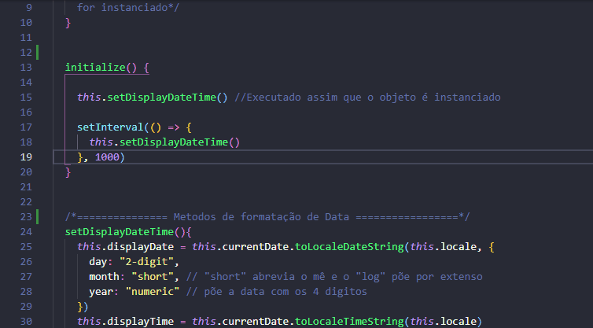

Agora vamos criar uma variavel que vai receber todos os elementos que forem botões, e em seguida seleciona-los usando o `querySelectorAll`.

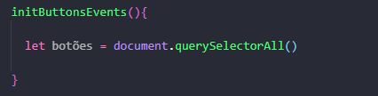

E dentro do parentesses nós passaremos em formato de string os nomes dos ids, classes ou tags que correspondem aos elementos que vamos selecionar.
Neste caso, iremos passar duas condições: 

1° A condição que queremos selecionar todas as tags `<g>` filhas do nosso elemento com id `buttons`.

2° A condição de que queremos fazer o mesmo só que dessa vez com o id `parts`.

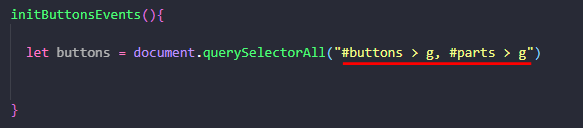

> Perceba que estamos usando a seguinte expressão **`#buttons > g`**, isso significa que estamos selecionando a tag filha **`<g>`** do elemento de **`#buttons`** 
 
Para ter certeza se realmente esses elementos foram selecionados, vamos imprimir essa variavel no nosso console do navegador.

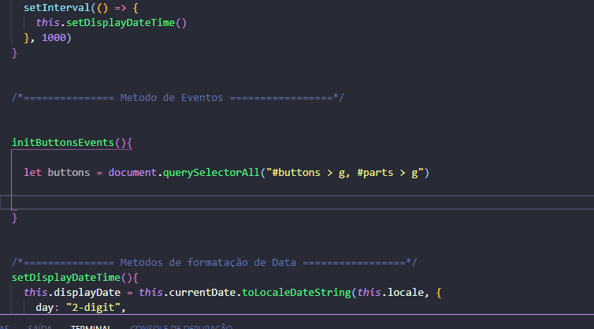

> Perceba no gif acima que nos foi retornado um nodeList com todos os elementos html que represetam os botões.

Agora nós precisamos adicionar um evento de click para cada um desses botões, faremos isso usando o metodo **`addEventListener()`**. Este método recebe dois parametros, o primeiro é o nome do evento que ele vai ficar esperando acontecer, e o segundo é a função que será executada assim que o evento for acionado.

Estrutura:
```JS
  addEventListener('click', function)
```

Quando estamos usando **`addEventListener()`**, nós precisamos nos atentar que ele só adiciona um evento para um unico elemento. Ou seja, para listas de elemento ele não funciona, talvez você tenha percebido que quando imprimimos no console a variavel `buttons` nos foi retornado um NodeList, o que nos impossibilita de usar este método, então para utiliza-lo nós precisaremos informar ao **JavaScript** que ele precisa adicionar este evento em **"cada um dos elementos".**

Para isso nós utilizaremos o metodo **forEach**, ele resumidamente adiciona uma função para cada elemento de uma lista/array.
**Sintaxe:**
```JS
lista.forEach((elements)=>{..}) // executa a função em cada um do elementos da lista, esses elementos sao pegos pelo parametro da função.
```
Agora que sabemos que podemos adicionar uma função para cada elemento da nossa NodeList, vamos definir que essa função vai executar nosso evento de click.

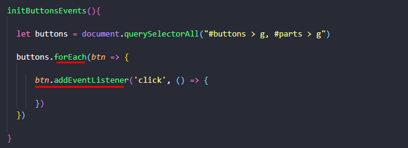

> Observer que o forEach recebe uma arrow function, e essa função tem um parametro que nós demos o nome de **`"btn"`**, esse parametro basicamente recebe a cada novo loop, um novo item da lista que o foreach está percorrendo. Por este motivo estamos utilizando esse mesmo parametro para adicionar o **`addEventListener()`**, permitindo que sejae adicionado este evento em cada um dos elementos da lista inteira.

Para saber se realemnte tudo esta funcionando, basta nós colocar para imprimir o elemento que estamos clicando e observa se ele aparece no console da **devTools**

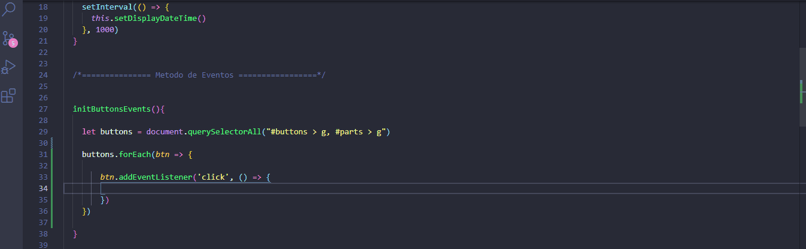

> Perceba que o evento realmente já está sendo aplicado para cada botão da nossa calculadora.

Agora vem a grande sacada na construção da nossa calculadora, note que os nomes das classes dos botões já informam se eles são numericos ou operadores.

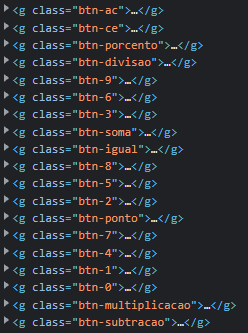

Então sabendo dessa informação, basta nós extrairmos do nome da classe apenas a informação que serve para identificar o botão que estamos clicando, nós faremos isso selecionado os nomes de classe desses botões e em seguida selecionado o valor basse desses nomes, que é basicamente o nome da classe em si.

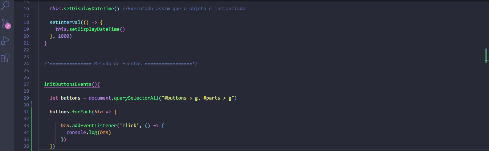

Agora que já aprendemos a pegar somente o nome das nossas classes, nós podemos usar o método **`replace()`** que sunstitui um texto por alguma outra coisa, só que neste caso vamos usa-lo para substituir o **`btn-`** por uma string vazia, deixando somente os numeros e nomes de operadores.


Se nós quisermos adicionar mais de um evento ao nosso botão como por exemplo o evento de clicar e arrastar (drag), nós teremos que criar multiplos **EventListeners** e isso tornaria o cogigo muito grande, por isso iremos criar um méto especifico que irá se encarregar de receber esses evemtos e executa-los.

Esse método vai se chamar `AddEventListenerAll`, e nele iremos colocar 3 parametros, o primeiro será o elemento/botão que vamos adicionar o evento, o segundo é uma lista contendo todos os eventos, e o terceiro é a função que o evento vai executar.

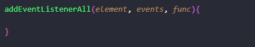

Agora basta nós trocarmos o metodo `addEventlistener` pelo nosso `addEventlistenerAll` e passarmos todos os paramtreos que definimos anteriormente.

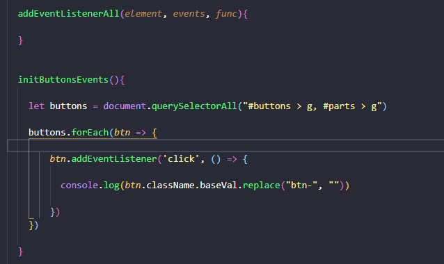

Perceba que ao trocarmos os métodos nós tambem substituimos a palavra **`btn`** pela **`this`**, isso porque basicamente estamos dizendo que queremos executar **este** método da nossa classe em cada botão que nosso **`forEach`** nos passar.

Em seguida ja passamos os 3 paramos que o nosso método necessita, sendo o primeiro o botão que o forEach está nos passando, o segundo a string com nome de todos os eventos que serão executados, e por ultimo a função que os eventos vão executar.

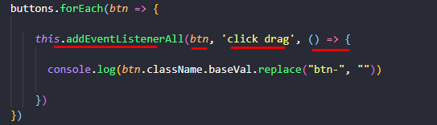

Agora basta criar dentro do nosso eventos recebidos, para isso começaremos usando o método **`split()`** para transformar nossa **`string`** que contem os eventos em um **`array`**, passando como separação entre as palavras o espaço em branco, e em seguida fazendo um forEach no array que o **split** retorna para pegar cada um desses eventos.


> note acima que usamos o console log para verificar se o split estava nos retornando o array corretamente, após isso nós ja demos um forEach no nosso split ou seja no valor que ele retornou, assim pegamos cada um dos nomes dos eventos no nosso array.

Por fim é so adicionarmos dentro da função que o nosso forEach recebe de argumento um `addEventlistener` em cada elemento/botão que nosso método recebeu como parametro,

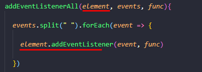

Agora nós passamos como argumento para nosso  **`addEventlistener`** o evento que o nosso **`forEach`** pegou, e atambém função que recebemos de parametro do nosso método **`addEventlistenerAll`**.


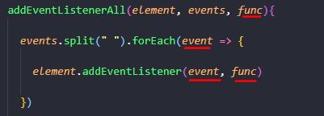

É impotante lembrar que quando clicamos no botão nós acionamos eventos tantos no SVG dos numeros e letras, quanto no SVG que dá o formato para nosso botão, então isso pode dar um conflito em algum momento e fazer com que quando um botão seja apertados o evento seja acionado de forma duplicada.

Para evitarmos isso basta adiconar um terceiro parametro para nosso **`addEventlistener`**, esse parametro vai ser a palavra reservada **`false`**, isso vai impedir de o evento ser executado com duplicidade.

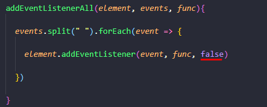
 
 Basta agora ir no console do navegador e verificar se tudo está funcionando corretamente.

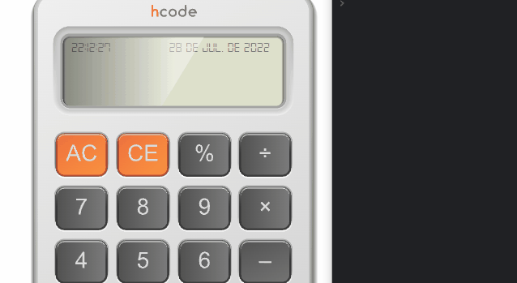


Com isso qualquer evento novo que adicionarmos vai ser executado, para testar vamos aproveitar e criar um novo evento, ele vai transformar nosso cursor do mouse em uma maozinha cada vez que a gente passar ele por cima de alguma tecla.

Faremos isso utilizando nosso mesmo método **`addEventlistenerAll`** novamente dentro do nosso Método **`initButtonsEvent`**.

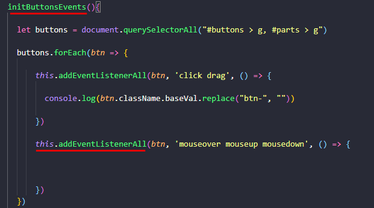

Passamos como argumento dessas vez, os eventos de manter, passar e retirar o mouse em cima do botão.

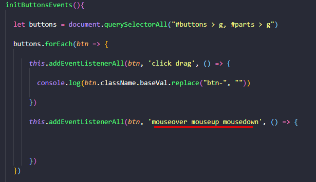

Agora é só definir o que a função que esses ventos vao executar vai fazer, para isso vamos apenas dizer que o estilo do **`btn`** vai ser igual a um **`"pointer"`**

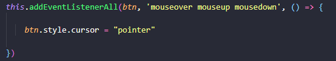


<br>
<br>

Projeto em Andamento....
<br>
<br>


## **Sites de consulta**

**<a hrf="https://www.treinaweb.com.br/blog/o-que-e-mvc">TreinaWeb</a>**
