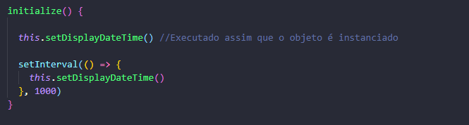

# Calculadora JavaScript 
 
 
Este projeto foi proposto pela <a href="https://www.hcode.com.br">Hcode</a>, no seu curso fornecido na plataforma Udemy (<a href="https://www.udemy.com/course/javascript-curso-completo/"> 
JavaScript - Curso COMPLETO com 6 Projetos REAIS</a>) 
 
 
Neste projeto faremos somente a parte do script, dando funcionalidade a nossa calculadora. 
Todo o front-end e os arquivos necessários foram foi previamente fornecido pelo proprio cruso e pode ser encontrado em <a  href="https://github.com/hcodebr/curso-javascript-projeto-calculadora-clone">gitHub/Hcode</a> 
 
 
 
 
<p style="color:grey; padding:0; margin: 0;">Calculadora desenvolvida como exemplo do Curso Completo de JavaScript na Udemy.com.</p> 
 
 
<br> 
 
# Documentando o aprendizado  


## **Entendendo o arquivo **<span style="color: rgb(207, 110, 110);">HTML<span>****

A calculadora que estamos vendo foi feita por meio arquivos SVG, e geradas por softwares de edição de imagem.  
 
 
Em nosso arquivo **HTML** nós temos uma **tag** chamada ```<g class="buttons">``` que é responsável por armazenar todos os nossos botões da calculadora, e também a tag ``` <g id="parts">``` que contem os  textos e números dos botões, cada arquivo dessas duas tags que representam os botões contem o mesmo nome de classe, isso serve para que quando usarmos o ```JavaScript``` para adicionar a funcionalidade de click, que ela possa ser acionada tanto clicando nas letras quanto no SVG dos botões. 

**Exemplo:**
```html
  <g class="buttons">
      <g class="btn-porcento"></g> <!-- SVG dos botões -->
  </g>

  <g id="parts">
      <g class="btn-porcento"></g> <!-- SVG dos textos/numeros -->
  </g>
```

Teremos também dentro da nossa tag ```<g id="base">``` nós teremos 3 elementos que daremos funcionalidades usando o ```JavaScript```

```html
<text id="display"></text> <!-- É o texto que contem os calculos -->
<text id="hora"></text> <!-- É o texto que contem as horas -->
<text id="data"></text> <!-- É o texto que contem a data-->
```
Esses serão os principáis ids usados.

<br>
<br>
 
## **Conceitos **<span style="color: yellow;">JavaScript<span>**** 
 
 
Antes de codar nós precisaremos entender melhor 2 conceito, o MVC(Model View Controller) e o POO(Orientação a Objeto). Estes dois conceitos ajudarão a entender melhor como organizar seu código e seus dados. 
 
 
**<h3 style="color:rgb(153,50,204); font-weight: bold;:">MVC (Model View Controller)</h3>** 
 
 
O ```MVC``` é um padrão de arquitetura de software, que sugere uma maneira de dividir responsabilidades dentro de um software web. 
 
 
Esse padrão sugere a divisão da nossa aplicação em 3 camadas diferentes: 
 
 
 
 
 
Imagem retirada do site <a hrf="https://www.treinaweb.com.br/blog/o-que-e-mvc">TreinaWeb</a>  
 
 
<br> 
 
 
1° A camada de interação do usuário **(View)**, é responsável pela interface que será apresentada, mostrando as informações para o usuário. 
 
 
2° A camada de manipulação dos dados **(Model)**, é responsável pelo acesso e manipulação dos dados na sua aplicação. 
 
 
3° A camada de controle da aplicação **(Controller)**, é a camada de controle, responsável por ligar o model e a view, fazendo com que os dados possam ser repassados para as views e vice-versa. 
 
 
<br> 
 
 
Na prática nós iremos criar um diretório chamado ```controller``` dentro do nosso diretório ```script``` e vamos criar um arquivo chamado ```calcController.js``` 
 
 
 
 
 
Esse arquivo vai conter nossas classes e métodos que ligarão a view e a model. 
 
 
Agora nós importaremos esse arquivo ```calcController.js``` para pode usar as classes e os métodos contidos neles nos nossos demais arquivos js. 
 
 
Faremos isso indo no nosso arquivo HTML e importando um novo script acima do ```calculadora.js``` isso porque nós queremos que esse arquivo seja importado antes, para que o calculador.js possa utiliza-lo. 
A ordem precisa ser essa se não o as classes e métodos estarão inacessíveis. 


A ordem de importação dos arquivos obrigadoriamente deve ser essa, para que o arquivo calculadora consiga acessar as classes e netodos do nosso arquivo controller
 
 
 
<br> 
<br> 
 
  
**<h3 style="color:rgb(153,50,204); font-weight: bold;:">POO (Programação Orientada a Objeto)</h3>**  
  
  
Na orientação a objeto os conceitos principais que precisamos entender são as ```classes```, ```Atributos```, ```Métodos``` e ```Objetos```, que são basicamente variáveis e funções só que com recursos amais.  
  
  
**Classes**   
  
  
É um conceito abstrato, como um molde, que se torna concreto e palpável através da criação de um objeto, isso porque ela estará guardando os métodos e atributos que vão construir e manipular esses objetos.   
  
  
**Atributos**  
  
  
São variáveis, só que quando estão dentro de uma classe elas recebem o nome de ```atributo```.  
  
  
**Métodos**  
  
  
São as funções que são armazenadas na nossa classe, só que quando essas funções pertencem a uma classe, elas são chamadas de ```Métodos```  
  
  
**Objetos**  
 
 
Objeto é a representação de tudo alguma coisa que existe, em forma de dados estruturados, quando os objetos estão vinculados a uma classe eles são chamados de instância.  
 
 
<br> 
 
# Iniciando nosso projeto
Primeiro vamos começar criando uma classe ```CalcController``` em nosso arquivo ```controller.js```


 
Agora vamos instanciar uma classe, para isso criaremos uma variável chamada calculadora e vamos utilizar a palavra reservada **```new```** para fazer referência a nossa classe. 
 
 
 
 
 
> Podemos ler essa linha de codigo como: "A variável calculadora recebe uma nova copia da classe CalcController" 
 

<br> 
 
**<h2>Método Constructor</h2>** 
 
 
Agora que criamos a nossa classe nós começaremos atribuindo a ela o nosso primeiro Método, o **```constructor```**. Este método vai ser executado assim que iniciarmos nossa classe, ele cria e inicializa um objeto criado a partir de uma classe, basicamente ele vai ajudar a construir todo objeto criado a partir da classe em que o objeto esta vinculado/instanciado.  
  
  
  
  
  
>Note que dentro do método constructor nós temos dois atributos ```displayCalc``` e ```dataAtual```.  
  
  
A palavra reservada ```this``` neste caso, faz com que o objeto criado a partir desta classe contenha esses atributos já pré definidos, que poderão ser chamados em qualquer parte da nossa classe, ou seja, o **this** é uma referência ao próprio objeto instanciado que está recebendo aqueles atributos.  
  
  
 
 
> Basicamente o pode ser lido da seguinte forma: "Este objeto instanciado contem um atributo que recebe o valor de..."  
> 
> Vamos usar o primeiro atributo para entender o que estas linhas de código estão fazendo, estamos dizendo o seguinte:  
> 
>"Este objeto criado a partir desta classe, contem um atributo chamado ```_displayCalc```, e este atributo recebe como valor o **elemento HTML** que contem o ```id``` igual a ```display```" 
 
 
<br> 
<br> 
 
 
## **Métodos Getters e Setters** 
Agora que já aprendemos a usar o método construtor, e também aprendemos a usar a palavra ```this``` para atribuir atributos para o nosso objeto instanciado, nós iremos entender o que fazem os métodos ```Getters``` e ```Setters``` em JavaScript. 
 
 
O ```Getters``` é utilizado pelo prefixo ```get``` que tem a função de retornar um determinado valor. 
 
 
O ```Setters``` é utilizado pelo prefixo ```set``` que tem a função de atribuir um valor.  
 
 
Agora que entendemos o que cada um desses métodos faz, vamos ver na pratica eles funcionando. 
 
 
 
 
 
> No método ```get``` estamos basicamente dizendo que seu nome vai ser o ```displayCalc```, e que este método vai nos retornar o texto interno do atributo ```_displayCalcEl``` neste objeto instanciado. 
> 
>Já no caso do método ```set``` nós estamos dizendo que o HTML interno do atributo ```_displayCalcEl``` vai receber o valor do parâmetro recebido 
 
 
Agora basta criamos esses mesmos métodos só que para os outros atributos do nosso objeto. 
 
 
No caso da data nós passaremos como valor que vai ser retornado uma nova data instanciada, isso vai permitir a manipulação da data posteriormente: 
 
 
 
 
 
Depois vamos definir os métodos que atribuirão um valor para os nossos elementos **HTML** (**"data"** e **"hora"**) 
 
 
 
 
 
Com isso nós podemos testar se estes métodos estão funcionando indo direto na devTools do navegador, lá vamos digitar os seguintes comandos: 
```JS 
 
 
/*================== Data local ====================*/ 
calculator.displayDate = new Date().toLocaleDateString('pt-BR') 
 
 
/*================== Hora local ====================*/ 
calculator.displayTime = new Date().toLocaleTimeString('pt-BR') 
``` 
 
 
 
 
 
> Note que assim que os comandos foram digitados no console do devTools do navegador, os valores foram mostrados no display da nossa calculadora. 
 
 
<br> 
<br> 
 
 
## **Horas com SetInterval** 
No gif acima talvez você tenha notado que as horas que foram mostradas no display da calculadora estavam estáticas, que o valor no display seja atualizado a cada segundo. 
 
 
O método que vai nos permitir fazer essa atualização é o ```setInterval()```, este método define um intervalo de tempo para algo ser executado, esse intervalo definido passando dois argumentos para esse método, o primeiro é a função/tarefa que ele vai executar e o segundo é o intervalo de tempo **"EM MILISEGUNDOS". 
 
 
Veja sua sintaxe: 
```JS 
setInterval(função, intervalo_em_milisegundos) 
``` 
No nosso caso a função vai ser atualizar a hora atual no display a cada 1 segundo. 
 
 
Para tornar tudo automático vamos criar um método chamado ```initialize```, daremos a ele esse nome porque sua função será executar algumas tarefas assim que nossa calculadora for iniciada. 
 
 
 
 
 
> Note que chamamos o nosso método dentro do nosso construtor, isso porque basicamente estamos falando que sempre que um novo Objeto Calculadora for instanciado esse método será executado. 
 
 
Agora basta usarmos o ```setInterval``` para criar nossa atualização de data e hora no display da calculadora. 
 
 
  
 
 
> Note que estamos dizendo que o nosso método ```displayDate``` vai receber como valor a data instanciada no método ```currentDate``` na forma de texto seguindo a localização da linguagem "pt-BR". 
 
 
Basicamente estamos passando um novo objeto data instanciado: 
 
 
 
 
 
E passando ele para nosso método ```displayDate``` inserir no HTML interno da nossa tag. 
 
 
 
 
 
Por fim é só fazer a mesma coisa com a horas. 
 
 
 
 
 
O mais interessante é que como definimos um intervalo de 1 segundo para essas informações serem mostradas no display, a hora será atualiza em tempo real. 
 
 
 
 
 
Agora como toque a mais no nosso código, de forma a deixa-lo mais organizado e também corrigir o delay que temos ao instanciarmos um novo objeto calculadora e a data e hora ser mostrada no display. 
 
 
Primeiro criaremos um método chamado ```setDisplayDateTime``` e atribuiremos a ele a tarefa que o ```setInterval``` estava fazendo. 
 
 
 
 
 
Depois chamaremos e executaremos esse método dentro do nosso ```initialize```, mas dessa vez fazermos com que ele seja executado antes do nosso ```setInterval``` e dentro dele também, isso permite que assim que sempre que atualizarmos nossa o **Pag** com nossa calculadora, a data e a hora apareçam de forma quase que instantânea e comecem a se atualizar a partir dai. 
 
 
 
 
 
Podemos ainda formatar nossa data e definir coisas como: quanto defitos o dia terá, se o mês será em forma de string ou number e etc... 
Para isso basta nós passarmos um segundo parâmetro para nosso método ```toLocateDateString()```, esse parâmetro vai ser um objeto informando as nossas pré definições para esta data local. 
Exemplo:  
```JS 
    this.displayDate = this.currentDate.toLocaleDateString(this.locale, { 
      day: "2-digit", 
      month: "short", ou "long" // "short" abrevia o mês e o "log" poe por extenso 
      year: "numeric" // põe a data com os 4 dígitos 
    }) 
``` 
 


## **Sites de consulta** 
 
 
**<a hrf="https://www.treinaweb.com.br/blog/o-que-e-mvc">TreinaWeb</a>** 
 